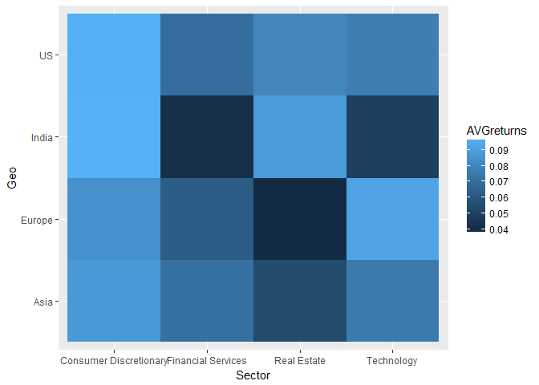
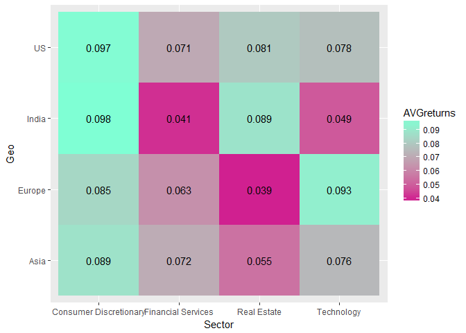
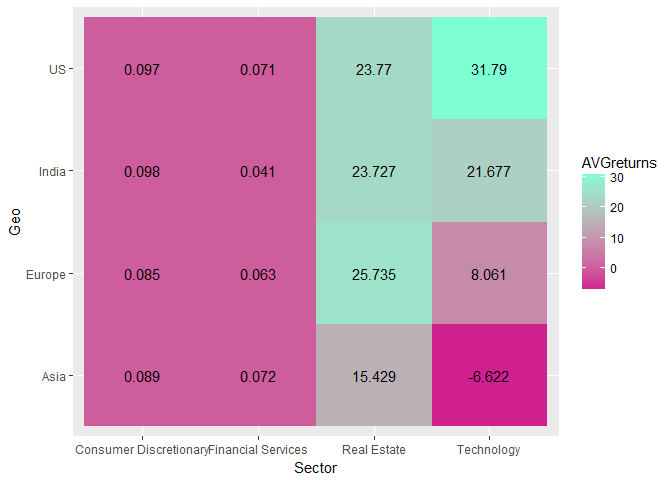
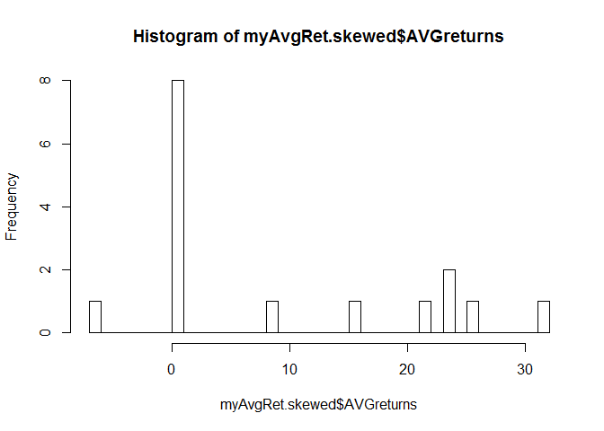
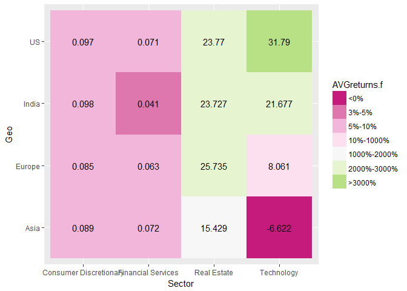

Creating easy Heatmaps in ggplot
================
Jerry Chee
March 8, 2019

Why visualise data in heatmaps?
-------------------------------

There are often times where our data comes accompanied by descriptive attributes and we'd like to quickly 'look' at our data by summarising it across those attributes.

Referencing the asset management for context, a view of **across sectors and geographies** is a typical first step of asessing how financial markets have moved (eg. returns, valuations) and where pockets of opportunities are.

Getting started: Simulate financial market data
-----------------------------------------------

Let's create a sample dataset which perhaps simulates the rate of dengue occurence in different households of Singapore, accompanied by the level of income of those households and the towns within which those households reside.

``` r
# Let's quickly load some standard R packages here so that you can follow this article. 
# If tidyverse is not yet installed, you may do so like such: > install.packages('tidyverse')
library(tidyverse)

# Some sector and geographies for illustration
sector <- c("Technology","Consumer Discretionary", "Real Estate", "Financial Services")
geography <- c("Asia", "Europe", "US", "India")
# Simulate market returns based on a random normal distribution, with a mean return of 8% and volatility (standard deviation) 15%
returns <- data.frame(Returns = round(rnorm(n = 1000, mean = 0.08, sd = 0.15), 2)) 

mydata <- cbind(Sector = sample(sector, 1000, replace = T), Geo = sample(geography, 1000, replace = T), returns)

head(mydata, 10)
```

    ##                Sector    Geo Returns
    ## 1          Technology Europe   -0.11
    ## 2          Technology     US    0.10
    ## 3          Technology   Asia    0.11
    ## 4         Real Estate   Asia   -0.22
    ## 5          Technology  India   -0.25
    ## 6  Financial Services Europe    0.03
    ## 7         Real Estate   Asia    0.07
    ## 8         Real Estate     US   -0.19
    ## 9         Real Estate Europe   -0.02
    ## 10 Financial Services   Asia    0.15

A few things we'd like to ask our data:

1.  What was the average return across sectors?
2.  What was the average return across geographies?
3.  Which sector + geography combination had the most movement?

The first 2 questions are easier to tackle on data tables because they single-dimension, but a heatmap would help visualise the answer much quicker.

Summarising our data
--------------------

``` r
# Let's take a simple average across sector + geographies
myAvgRet <- mydata %>%
  group_by(Sector, Geo) %>%
  summarise(AVGreturns = mean(Returns))

# Summarised data in long-form
myAvgRet
```

    ## # A tibble: 16 x 3
    ## # Groups:   Sector [?]
    ##    Sector                 Geo    AVGreturns
    ##    <chr>                  <chr>       <dbl>
    ##  1 Consumer Discretionary Asia       0.0826
    ##  2 Consumer Discretionary Europe     0.0706
    ##  3 Consumer Discretionary India      0.0945
    ##  4 Consumer Discretionary US         0.105 
    ##  5 Financial Services     Asia       0.0551
    ##  6 Financial Services     Europe     0.0591
    ##  7 Financial Services     India      0.0576
    ##  8 Financial Services     US         0.0747
    ##  9 Real Estate            Asia       0.100 
    ## 10 Real Estate            Europe     0.106 
    ## 11 Real Estate            India      0.0791
    ## 12 Real Estate            US         0.0658
    ## 13 Technology             Asia       0.092 
    ## 14 Technology             Europe     0.0521
    ## 15 Technology             India      0.110 
    ## 16 Technology             US         0.104

Heatmap plotting - Quick and dirty
----------------------------------

The quickest way to plot without custom functions is to rely on `heatmap` from base R.

``` r
# Convert to wide-form and move Sector names to rownames so that we can get a numeric matrix

myAvgRet.mat <- myAvgRet %>%
  # Convert long-form to wide-form
  spread(key = Geo, value = AVGreturns) %>%
  as.data.frame %>%
  # Extract column 'Sector' and use it to name rows. 
  # This is necessary so the final output is a numeric matrix, the input which the heatmap function takes
  column_to_rownames(var = "Sector") %>%
  as.matrix

# The matrix looks already like how we want to visualise it
myAvgRet.mat
```

    ##                              Asia     Europe      India         US
    ## Consumer Discretionary 0.08256757 0.07064935 0.09454545 0.10516129
    ## Financial Services     0.05514706 0.05909091 0.05764706 0.07467742
    ## Real Estate            0.10013699 0.10614035 0.07910714 0.06580645
    ## Technology             0.09200000 0.05206349 0.10973333 0.10447368

``` r
# Notice how the column 'Sector' has become data captured as row names?
str(myAvgRet.mat)
```

    ##  num [1:4, 1:4] 0.0826 0.0551 0.1001 0.092 0.0706 ...
    ##  - attr(*, "dimnames")=List of 2
    ##   ..$ : chr [1:4] "Consumer Discretionary" "Financial Services" "Real Estate" "Technology"
    ##   ..$ : chr [1:4] "Asia" "Europe" "India" "US"

``` r
# use base heatmap to plot
plot1 <- heatmap(myAvgRet.mat, Colv = NA, Rowv = NA, scale = "column")
```


``` r
plot1
```

    ## $rowInd
    ## [1] 1 2 3 4
    ## 
    ## $colInd
    ## [1] 1 2 3 4
    ## 
    ## $Rowv
    ## NULL
    ## 
    ## $Colv
    ## NULL

That was fairly quick, wasn't it?

On second thoughts, however, to modify this heatmap to control for things like (A)**Colour palette**, (B)**Cell labels**, (C)**Colour Scale**, is possible but requires much [manipulation](https://sebastianraschka.com/Articles/heatmaps_in_r.html).

Heatmap plotting - The **ggplot2** way
--------------------------------------

`ggplot` works only with the class dataframe, which is alright because that's the class which most of your datasets should be in given its flexibility to contain multiple classes of data within anyway.

Let's see what the most basic heatmap looks like in ggplot.

``` r
library(ggplot2)

g1 <- ggplot(myAvgRet, aes(x = Sector, Geo)) +
  geom_tile(aes(fill = AVGreturns))
g1
```



That wasn't too bad, pretty close to the first method we saw above.

**Now let's add the labels.**

``` r
ggplot(myAvgRet, aes(x = Sector, Geo)) +
  geom_tile(aes(fill = AVGreturns)) +
  geom_text(aes(label = round(AVGreturns, 3)))
```


What if we didn't like blue?

``` r
ggplot(myAvgRet, aes(x = Sector, Geo)) +
  geom_tile(aes(fill = AVGreturns)) +
  geom_text(aes(label = round(AVGreturns, 3))) +
  # As our values are continuous, we'll use scale_fill_continuous instead of scale_fill_manual
  scale_fill_continuous(low = "violetred", high = "aquamarine")
```



### *Other tips and tricks*

There will be times where your data contains wildly skewed values and the automated colour fill will not work as well.



Looking at the histogram of AVGreturns now, it's clear that we might need to fine-tune the colour breakdown for the 0-1 bucket, else it will get washed out with the values above 10.

In order to do this, we need to intervene by indicating our own intervals. To do this, we need to convert the numeric column AVGreturns into ordered factors, based on our discretion of the intervals.

``` r
# Create a new variable which is a factorised version of AVGreturns
myAvgRet.skewed$AVGreturns.f <- cut(myAvgRet.skewed$AVGreturns,
                                    breaks = c(min(myAvgRet.skewed$AVGreturns), 0, 0.01, 0.03, 0.05, 0.1, 10, 20, 30, max(myAvgRet.skewed$AVGreturns)),
                                    labels = c("<0%", "0-1%", "1%-3%", "3%-5%", "5%-10%", "10%-1000%", "1000%-2000%", "2000%-3000%", ">3000%"), include.lowest = T)

# Create plot based on the factorised column
ggplot(myAvgRet.skewed, aes(x = Sector, Geo)) +
  geom_tile(aes(fill = AVGreturns.f)) +
  geom_text(aes(label = round(AVGreturns, 3))) +
  # Given that factors have discrete levels, we need to use scale_fill_manual instead of scale_fill_continuous
  scale_fill_manual(values = RColorBrewer::brewer.pal(9, "PiYG")) # Use RColorBrewer for discrete categories
```



#### Resources for colouring plots

[RColorBrewer](https://www.r-graph-gallery.com/38-rcolorbrewers-palettes/)

[R colour palette](https://www.nceas.ucsb.edu/~frazier/RSpatialGuides/colorPaletteCheatsheet.pdf)
